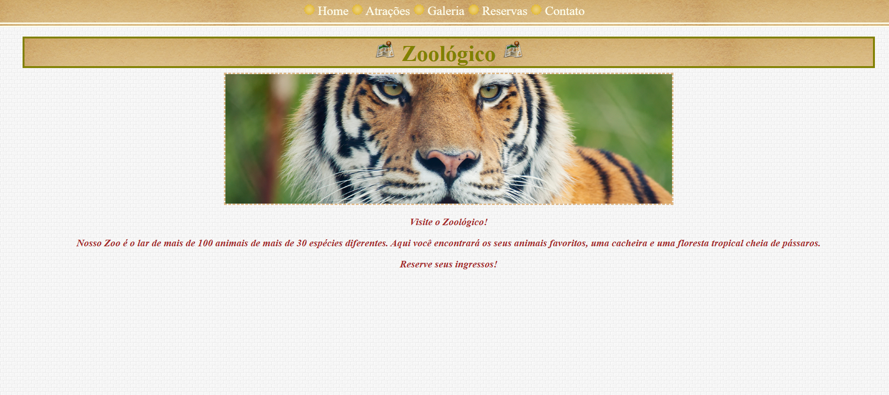
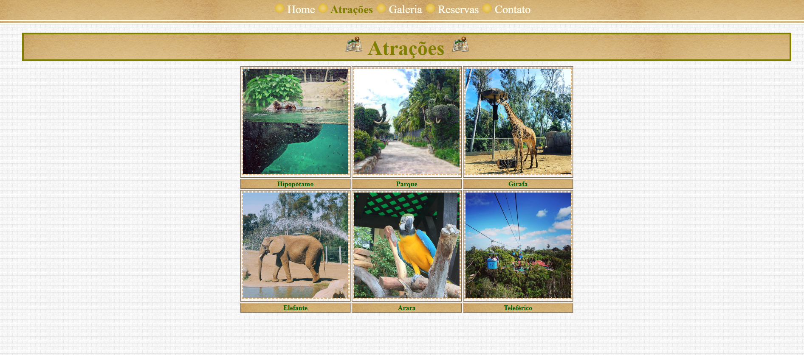
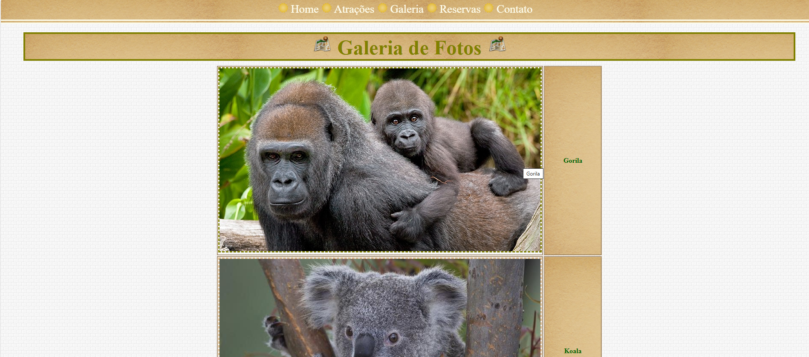
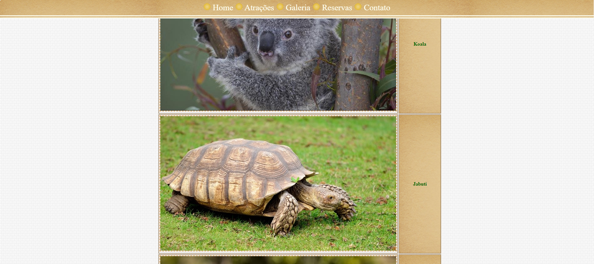
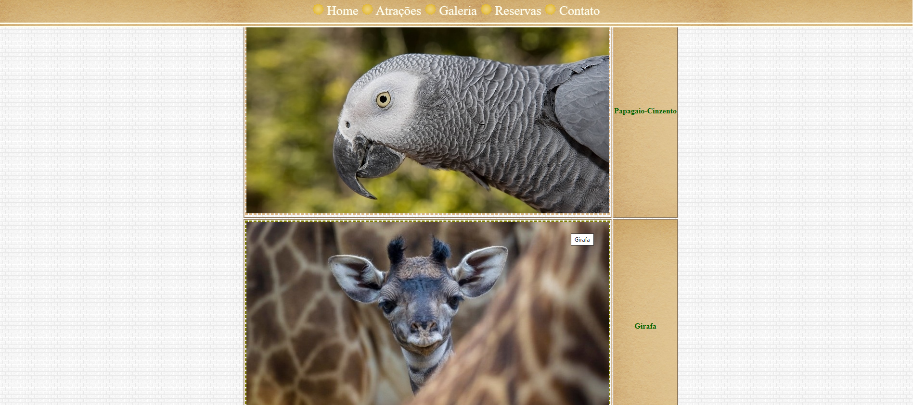
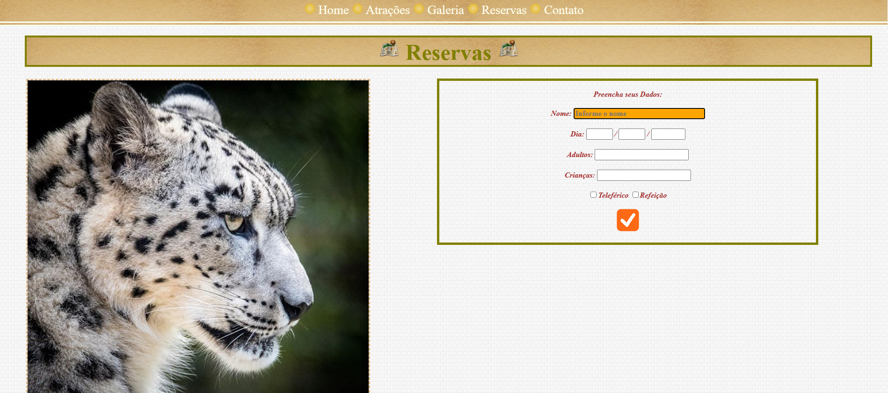
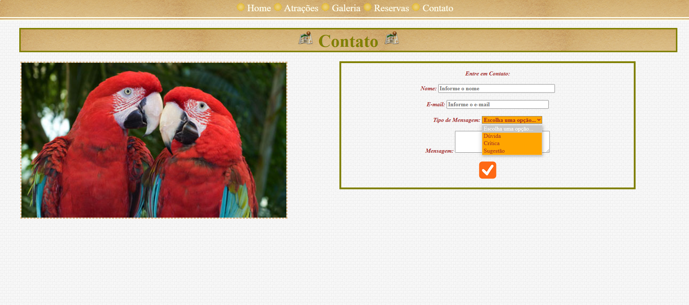

# atividadeCSS-Zoologico
atividade de CSS feita em aula
  

  <h3>Várias páginas com vários animais e efeitos. Esta é a inicial</h3>
  

  

  <h3>Páginas de atrações e galeria de fotos</h3>
  

  

  <h3>Reservas e contato com forms coloridinho.</h3>
  

  
